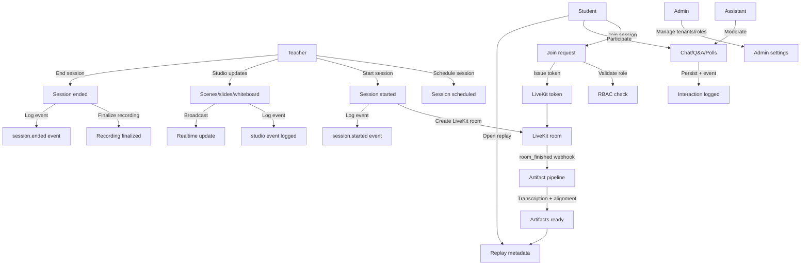

# UX Spec - Teaching-First Multi-Streaming Platform

This spec captures the minimum UX flows and screens required to ship the core teaching experience.

## 1. Principles
- Teaching-first over broadcast-first
- Clear session state (scheduled, live, ended)
- Low-latency studio updates
- Graceful degradation for async features

## 2. Roles
- Teacher: schedules and runs sessions, controls studio state
- Student: joins sessions, consumes content, participates
- Assistant: moderates chat/Q&A/polls
- Admin: manages tenants, roles, and policies

## 3. Core Screens
- Teacher dashboard: upcoming sessions, start/end controls, recent replays
- Session studio (teacher): video, scene/slide controls, whiteboard, audience view
- Student session: video, chat/Q&A/polls, timeline of scene changes
- Replay viewer: timeline, chapters, searchable transcript, highlights
- Admin settings: tenant profile, role management, retention settings

## 4. Core Flows
- Schedule session: teacher selects course/lesson, sets start/end, confirms
- Start session: teacher enters studio, system creates LiveKit room, state switches to live
- Join session: student enters waiting state, receives token, joins live room
- Scene updates: teacher changes scene/slide/whiteboard; students see changes in <200ms
- Interaction: chat/Q&A/polls persist and broadcast in real time
- End session: teacher ends class; recording finalized; replay marked "processing"
- Replay: student opens replay; sees timeline, transcript, and highlights when ready

## 4.1 Workflow Diagram

## 5. Fallbacks and States
- If chat/polls fail, show inline warning and keep session running
- If artifact processing is delayed, replay shows "processing" with partial data
- If LiveKit is unavailable, block start/join with clear retry guidance

## 6. UX Acceptance Criteria
- Teacher can start a session and see live status within 3 seconds
- Scene/slide changes propagate to participants in under 200ms in-region
- Students can submit chat/Q&A without blocking video
- Replay loads within 2 seconds with at least recording playback when artifacts exist
