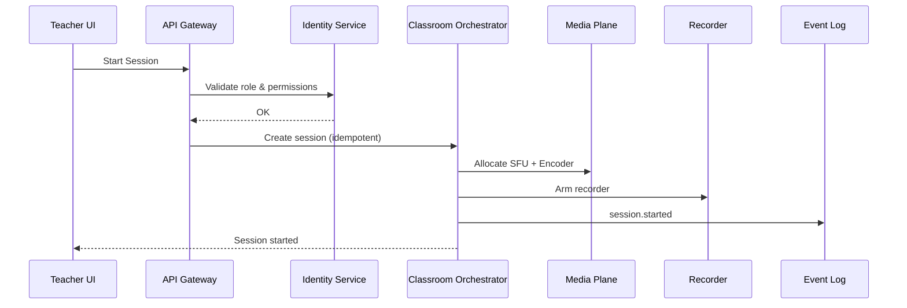
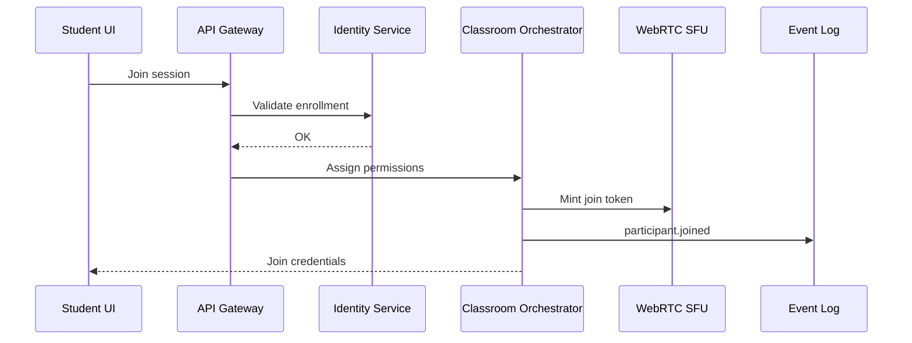
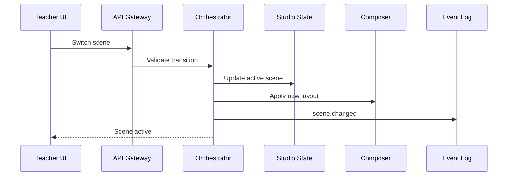
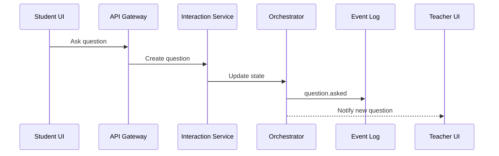
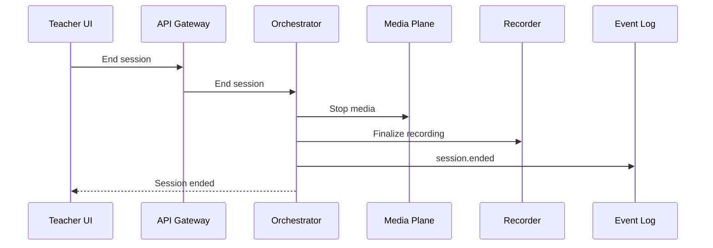
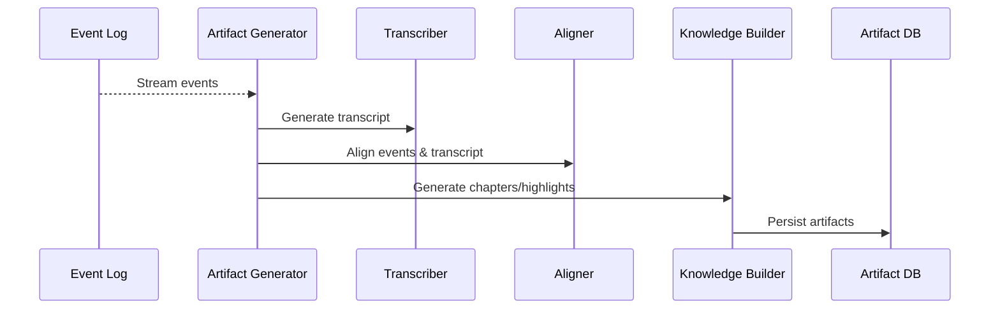
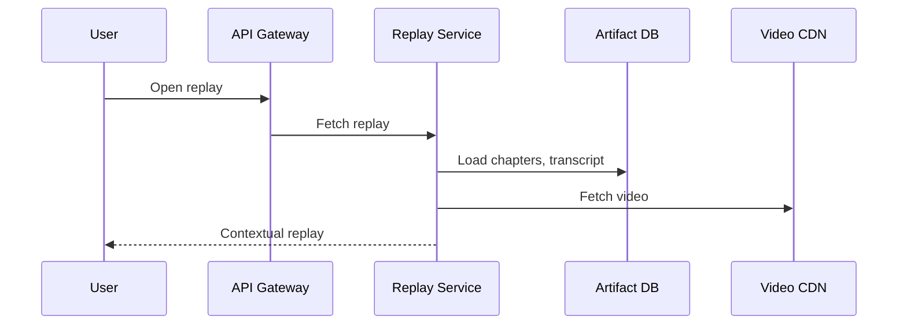

# MASTER SPECIFICATION
## Teaching-First Multi-Streaming Platform

This document merges all system specification artifacts into a single authoritative source of truth.

---

# 1. System Specification Steps
# plan_dev.md
## System Specification for a Teaching-First Multi-Streaming Platform

This document defines the **system specification** (not the execution timeline) for a teaching-first, multi-streaming platform. These steps describe **what must exist**, **how it must be structured**, and **what correctness means**.

---

## 1. Strategic Reframing

**Goal:** Define the product as a classroom system that happens to livestream.

### Tasks
- Establish that this is a **teaching-first** platform, not a webinar tool.
- Identify core pedagogical needs: roles, classroom logic, artifacts, replays, engagement.
- Define success metrics based on learning outcomes, not viewer counts.
- Document the product principle:
  > Classroom-first → Media-second → Distribution-last.

---

## 2. Teaching-First Architecture

**Goal:** Define system layers and boundaries.

### Tasks
- Define the major layers:
  - Client Layer (Teacher, Student, Assistant, Public)
  - API Gateway / BFF
  - Control Plane (authoritative logic)
  - Media Plane (real-time systems)
  - Data Plane (persistence and search)
- Define responsibilities of each layer.
- Define isolation rules between layers.
- Document which layers are allowed to fail without stopping a class.

---

## 3. Service Decomposition

**Goal:** Break the system into purpose-driven services.

### Tasks
- Define each service and its single responsibility:
  1. Identity & Roles
  2. Classroom Orchestrator
  3. Teaching Studio State
  4. Media Plane (SFU, Encoder, Recorder)
  5. Artifact Generator
  6. Replay & Knowledge UX
  7. Interaction Service
  8. Analytics & Learning Intelligence
  9. Multistream Fan-out
  10. Integration Gateway
- Assign ownership boundaries.
- Define what each service is NOT responsible for.
- Define service-to-service dependencies.

---

## 4. Component Diagram & Interaction Flows

**Goal:** Specify how services communicate.

### Tasks
- Define synchronous vs asynchronous interactions.
- Define real-time vs deferred processing paths.
- Define which failures must halt a class.
- Define which failures degrade gracefully.
- Model:
  - Session start
  - Student join
  - Scene switching
  - Q&A handling
  - Replay generation

---

## 5. Teaching-First Database Schema

**Goal:** Define the persistent truth model.

### Tasks
- Define multi-tenant data structures.
- Define role-based access models.
- Define session lifecycle tables.
- Define event-sourced core (`session_state_events`).
- Define artifact storage models.
- Define replay and analytics tables.
- Define integration and multistream isolation tables.

---

## 6. Feature → Backend Mapping

**Goal:** Eliminate ambiguity about feature ownership.

### Tasks
For each user-facing feature:
- Assign a single owning service.
- Define source-of-truth tables.
- Define sync vs async behavior.
- Define failure behavior.
- Ensure no feature spans services without explicit contracts.

Features include:
- Scheduling
- Joining
- Permissions
- Scenes
- Slides
- Whiteboard
- Chat
- Q&A
- Polls
- Captions
- Notes
- Recording
- Replays
- Chapters
- Highlights
- Multistreaming
- CTAs / QR codes

---

## 7. Teaching-First Artifact Pipeline

**Goal:** Convert video into learning.

### Tasks
- Define the immutable event taxonomy.
- Define raw artifact extractors.
- Define temporal alignment processes.
- Define derived knowledge generation.
- Define replay intelligence requirements.
- Define near-real-time vs post-processing stages.
- Define failure tolerance rules.

Pipeline stages:
1. Live Event Capture
2. Raw Extraction
3. Temporal Alignment
4. Knowledge Derivation

---

## Definition

These seven steps collectively define the **system specification**.

They answer:
- What must exist
- How it must be structured
- Who owns what
- What correctness means

They do NOT define:
- Timeline
- Staffing
- Budget
- Milestones
- Execution order

Those belong to the **implementation plan**, which is a separate document.

---

---

# 2. Architecture Diagrams

## 2.1 Textual Diagrams
# architecture_diagrams.md
## Teaching-First Multi-Streaming Platform — Architecture Diagrams (Textual)

### 1. High-Level System Diagram

Client Apps
  ├── Teacher UI
  ├── Student UI
  ├── Assistant UI
  └── Public Viewer
        ↓
API Gateway / BFF
        ↓
Control Plane
  ├── Identity & Roles
  ├── Classroom Orchestrator
  ├── Teaching Studio State
  ├── Interaction Service
  ├── Artifact Generator
  ├── Analytics & Learning Intelligence
  └── Integration Gateway
        ↓
Media Plane
  ├── WebRTC SFU
  ├── Composer / Encoder
  ├── Recorder
  └── Multistream Fan-out
        ↓
Data Plane
  ├── PostgreSQL (truth)
  ├── Redis (ephemeral)
  ├── Object Storage
  └── Search Index

---

### 2. Failure Isolation Diagram

If Multistream fails → Classroom continues  
If Analytics fails → Classroom continues  
If Artifact Generator fails → Classroom continues  
If Identity fails → Classroom halts  
If Orchestrator fails → Classroom halts  
If Media Plane fails → Classroom halts  

---

### 3. Event Flow Diagram (Simplified)

User Action → API Gateway → Owning Service → session_state_events → Subscribers
                                                   ↓
                                          Artifact Pipeline

## 2.2 Visual Diagram

<object data="architecture_diagram.png" type="image/svg+xml" width="900"></object>

<!-- Fallback: if your markdown viewer blocks SVG rendering, open architecture_diagram.png directly. -->

---

# 3. API Contracts
# api_contracts.md
## Teaching-First Multi-Streaming Platform — API Contracts (Draft)

### Authentication
POST /auth/login  
POST /auth/refresh  
POST /auth/logout  

---

### Classroom Orchestrator
POST /courses  
POST /lessons  
POST /lesson-runs  
POST /sessions/start  
POST /sessions/{id}/end  
GET  /sessions/{id}/state  

---

### Participation
POST /sessions/{id}/join  
POST /sessions/{id}/leave  
POST /sessions/{id}/permissions  

---

### Studio State
POST /sessions/{id}/scene  
POST /sessions/{id}/slides  
POST /sessions/{id}/layout  

---

### Interaction
POST /sessions/{id}/chat  
POST /sessions/{id}/questions  
POST /sessions/{id}/polls  

---

### Artifacts
GET /sessions/{id}/transcript  
GET /sessions/{id}/chapters  
GET /sessions/{id}/highlights  

---

### Replay
POST /sessions/{id}/publish  
GET  /replays/{id}  

---

### Multistream
POST /destinations  
POST /sessions/{id}/destinations  

---

### Webhooks
POST /webhooks  
GET  /webhooks/logs  

---

# 4. Risk & Dependency Mapping
# risk_dependency_map.md
## Teaching-First Platform — Risk & Dependency Map

### 1. Structural Risks

| Risk | Impact | Mitigation |
|------|--------|------------|
| Building Studio before Classroom logic | Fatal | Lock Orchestrator first |
| No event backbone | Fatal | Implement session_state_events early |
| Media coupled to UI | High | Enforce service boundaries |
| No artifact pipeline | High | Treat artifacts as core |
| Platform-first viewers | Medium | Require owned classroom viewer |

---

### 2. Technical Dependencies

| Feature | Depends On |
|--------|------------|
| Scene switching | Orchestrator, Studio State, Composer |
| Replays | Recorder, Artifact Generator |
| Chapters | Event log, Alignment engine |
| Engagement analytics | Event log, Aggregators |
| Multistream | Media Plane, Fan-out |

---

### 3. Kill-Switch Failures

If these fail → class must not start:
- Identity & Roles
- Classroom Orchestrator
- Media Plane

All others must degrade.

---

### 4. Validation Gates

| Gate | Must Prove |
|------|------------|
| G1 | Session lifecycle is correct |
| G2 | Permissions enforced |
| G3 | Events captured |
| G4 | Recording works |
| G5 | Replay searchable |
| G6 | Artifacts aligned |

---

# 5. Sequence Diagrams
# sequence_diagrams.md
## Teaching-First Multi-Streaming Platform — Sequence Diagrams

These diagrams describe **runtime behavior** of the system. They are not conceptual; they define how services must interact.

---

## 1. Start Class (Teacher clicks "Go Live")

Failure rules:
- If Identity fails → abort.
- If Media allocation fails → abort.
- If Event logging fails → abort.

---

## 2. Student Joins Class

---

## 3. Teacher Switches Scene

---

## 4. Student Asks Question

---

## 5. End Class

---

## 6. Artifact Generation (Async)

---

## 7. Replay View

---

## Interpretation

These diagrams define:
- Sync vs async boundaries
- What is critical vs optional
- Who owns state
- What must be idempotent
- What cannot be UI-driven

They should be used to:
- Implement services
- Write tests
- Define mocks
- Validate correctness

---

# 6. Teaching-First Database Schema
# teaching_first_database_schema.md
## Teaching-First Database Schema (Draft)

This document defines the authoritative data model, including multi-tenant boundaries, event sourcing, and artifact persistence. See: [`teaching_first_database_schema.md`](teaching_first_database_schema.md).

---

# 7. Feature → Backend Mapping
# feature_backend_mapping.md
## Feature → Backend Mapping (Draft)

This document assigns each user-facing feature to an owning service, its source-of-truth tables, and failure behavior. See: [`feature_backend_mapping.md`](feature_backend_mapping.md).

---

# 8. Teaching-First Artifact Pipeline
# teaching_first_artifact_pipeline.md
## Teaching-First Artifact Pipeline (Draft)

This document defines how live classroom events become transcripts, chapters, highlights, and replay intelligence. See: [`teaching_first_artifact_pipeline.md`](teaching_first_artifact_pipeline.md).

---

# 9. Security & Compliance
# security_compliance.md
## Teaching-First Multi-Streaming Platform — Security & Compliance Layer

This document defines the security, privacy, and compliance foundations for a classroom-first platform.

---

## 1. Threat Model

### Actors
- Students
- Teachers
- Assistants
- Admins
- External Integrations
- Malicious actors

### Assets
- Personal data (PII)
- Classroom recordings
- Transcripts
- Student interactions
- Authentication credentials
- Destination stream keys

---

## 2. Security Architecture

### Identity & Access
- OAuth2 / OpenID Connect
- Short-lived JWTs
- Role-based access control (RBAC)
- Session-scoped permissions

### Secrets Management
- Encrypted at rest (KMS)
- Rotated regularly
- Never exposed to clients

### Network Security
- mTLS between services
- Private VPCs
- Zero-trust principles

---

## 3. Data Protection

### At Rest
- AES-256 encryption
- Separate encryption domains per tenant

### In Transit
- TLS 1.3 everywhere
- HSTS enforced

### Backups
- Encrypted
- Region-separated
- Regular restore tests

---

## 4. Privacy by Design

- Data minimization
- Purpose limitation
- Role-scoped access
- Student data isolation

---

## 5. Compliance Targets

### FERPA (US)
- Student educational record protection
- Access controls
- Audit logs

### GDPR (EU)
- Right to access
- Right to erasure
- Data portability
- Consent tracking

### COPPA (if minors)
- Parental consent
- Restricted data processing

---

## 6. Auditability

- Immutable event logs
- Access logs
- Permission change history
- Replay access logs

---

## 7. Content Safety

- Moderation tools
- Chat filtering
- Abuse detection
- Kill switches

---

## 8. Incident Response

- Detection pipelines
- Escalation policy
- Customer notification
- Forensic logging

---

## 9. Classroom-Specific Controls

- Recording consent
- Participant visibility controls
- Screen sharing restrictions
- Exam mode

---

## 10. Security Is a Feature

If security is bolted on later, this platform will fail in education markets.

---

# Definition of Scope

This master specification defines:

- What must exist
- How it must be structured
- What owns what
- How services interact
- How failure must behave
- How learning artifacts are produced
- How security, privacy, and compliance are enforced
